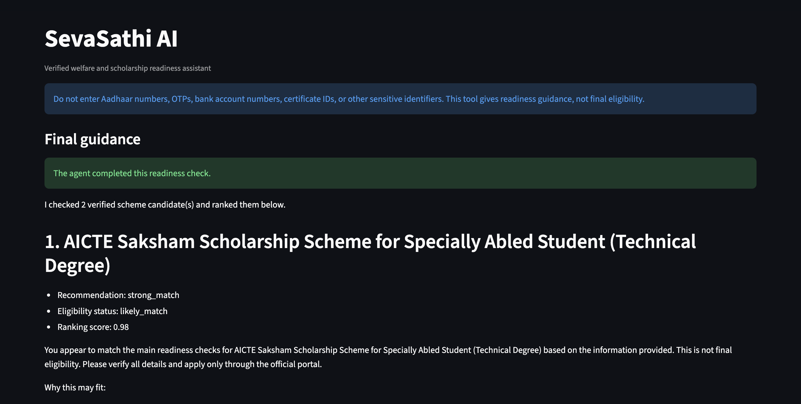
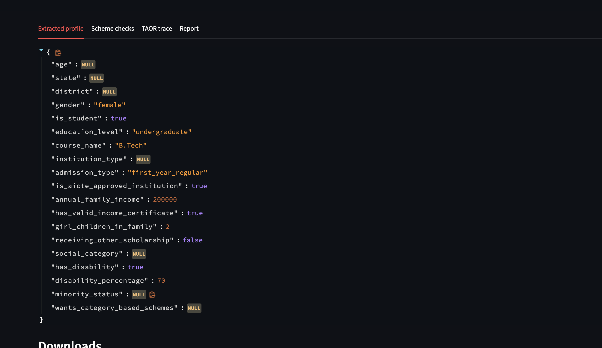

# SevaSathi AI

SevaSathi AI is a welfare and scholarship readiness assistant. It extracts a citizen/student profile from natural language, searches a verified local scheme database, checks machine-readable eligibility rules, asks follow-up questions for missing details, and produces cautious ranked guidance.

This project uses a hybrid AI architecture:

- LLMs handle natural-language profile extraction.
- Deterministic Pydantic models keep data structured.
- JSON eligibility rules decide scheme readiness.
- Search and ranking logic choose the best verified candidates.
- Streamlit provides an interactive UI with follow-up controls, reports, and trace output.

> SevaSathi AI gives readiness guidance only. It does not provide final eligibility decisions. Users should always verify details on official portals before applying.

## Screenshots

### Ranked Scheme Guidance



### Extracted Profile View



## Features

- Natural-language profile extraction using Groq-hosted LLM calls.
- Typed profile, scheme, eligibility, ranking, and trace models with Pydantic.
- Generic JSON-driven eligibility engine for adding new schemes without writing new Python branches.
- Candidate scheme search using state fit, rule compatibility, application window status, and query overlap.
- Follow-up question generation from missing eligibility rule fields.
- Structured Streamlit follow-up controls such as dropdowns, radios, and numeric inputs.
- Deterministic follow-up parsing so selected UI answers update the profile reliably.
- Ranking that combines search relevance and eligibility/readiness status.
- No-match handling when all verified candidates are blocked.
- Markdown report and JSON trace generation.
- Automated tests for search, rule evaluation, follow-up parsing, ranking support, loading, merging, and output writing.

## Architecture

```text
User details
    |
    v
Streamlit UI
    |
    v
LLM profile extraction
    |
    v
Profile merge
    |
    v
Scheme search
    |
    v
Eligibility rule engine
    |
    v
Ranking
    |
    +--------------------------+
    |                          |
    v                          v
Follow-up questions       Final guidance
    |
    v
Answers parsed and merged
    |
    v
Flow runs again with original search intent
```

## Project Structure

```text
.
├── app/
│   ├── eligibility_checker.py   # Selects generic or legacy eligibility checker.
│   ├── follow_up_parser.py      # Parses structured follow-up answers.
│   ├── llm_client.py            # Groq client helpers.
│   ├── models.py                # Pydantic data contracts.
│   ├── output_writer.py         # Markdown report and JSON trace generation.
│   ├── profile_extractor.py     # LLM-based profile extraction.
│   ├── profile_merge.py         # Merges initial and follow-up profile data.
│   ├── ranking.py               # Combines search and eligibility scores.
│   ├── rule_engine.py           # Generic JSON eligibility rule evaluator.
│   ├── scheme_loader.py         # Loads and validates schemes.json.
│   ├── scheme_search.py         # Candidate scheme search and relevance scoring.
│   └── taor_agent.py            # Main orchestration loop.
├── data/
│   └── schemes.json             # Verified local scheme database.
├── docs/
│   └── technical_flow.md        # Detailed technical walkthrough.
├── Images/
│   ├── extractedProfile.png
│   └── sevasathiapp.png
├── tests/
│   └── test_*.py
├── streamlit_app.py             # Main Streamlit UI.
├── main.py                      # CLI smoke-run entry point.
├── requirements.txt
└── pytest.ini
```

## How The Core Flow Works

1. The user enters details in the Streamlit UI.
2. `app/profile_extractor.py` asks the LLM to extract a `CitizenProfile`.
3. `app/profile_merge.py` merges new profile data with prior follow-up data.
4. `app/scheme_search.py` searches `data/schemes.json` for relevant scheme candidates.
5. `app/eligibility_checker.py` sends schemes with `eligibility_rules` to `app/rule_engine.py`.
6. `app/ranking.py` ranks checked schemes.
7. `app/taor_agent.py` either returns final guidance or asks follow-up questions.
8. Follow-up answers are parsed by `app/follow_up_parser.py`, merged into the profile, and the flow runs again using the original search intent.

For a deeper explanation, see [docs/technical_flow.md](docs/technical_flow.md).

## Quick Start

### 1. Clone The Repository

```bash
git clone <your-repo-url>
cd sevasathi-ai
```

### 2. Create A Virtual Environment

```bash
python3 -m venv .venv
source .venv/bin/activate
```

### 3. Install Dependencies

```bash
pip install -r requirements.txt
```

### 4. Configure Environment Variables

```bash
cp .env.example .env
```

Then edit `.env`:

```env
GROQ_API_KEY=replace_with_your_groq_api_key
GROQ_MODEL=llama-3.3-70b-versatile
APP_ENV=development
```

### 5. Run The Streamlit App

```bash
streamlit run streamlit_app.py
```

Open the local URL shown by Streamlit, usually:

```text
http://localhost:8501
```

## Running Tests

```bash
python -m pytest
```

The test suite covers:

- scheme JSON loading and validation,
- search relevance,
- generic eligibility rules,
- follow-up question behavior,
- deterministic follow-up parsing,
- profile merging,
- output report generation.

## Adding New Schemes

Schemes are stored in [data/schemes.json](data/schemes.json). A scheme should include:

- `scheme_id`
- `name`
- `summary`
- `target_groups`
- `benefits`
- `required_documents`
- `eligibility_text`
- `eligibility_rules`
- `application_window`
- `sources`

The most important field is `eligibility_rules`. These rules allow the app to support new schemes generically.

Example rule:

```json
{
  "field_name": "annual_family_income",
  "operator": "max_value",
  "expected_value": null,
  "expected_values": [],
  "min_value": null,
  "max_value": 800000,
  "matched_reason": "The user's family income is within the Rs. 8 lakh annual limit.",
  "missing_message": "Annual family income is missing.",
  "failed_reason": "The user's family income is above the Rs. 8 lakh annual limit.",
  "failure_type": "blocking"
}
```

Supported rule operators:

| Operator | Meaning |
| --- | --- |
| `equals` | Profile value must equal `expected_value`. |
| `in_list` | Profile value must be one of `expected_values`. |
| `max_value` | Numeric profile value must be less than or equal to `max_value`. |
| `min_value` | Numeric profile value must be greater than or equal to `min_value`. |
| `contains_any` | Text profile value must contain one expected term. |
| `is_true` | Profile value must be `true`. |
| `is_false` | Profile value must be `false`. |

Supported failure types:

| Failure Type | Behavior |
| --- | --- |
| `blocking` | A clear failure blocks the scheme from recommendation. |
| `missing` | A failure is treated as missing/readiness information instead of final rejection. |

## Privacy And Safety

The app is designed to avoid collecting sensitive identifiers. Users are warned not to share:

- Aadhaar numbers,
- OTPs,
- bank account numbers,
- certificate IDs,
- other sensitive identifiers.

The LLM profile extraction prompt also instructs the model not to store sensitive identifiers.

## Current Limitations

- The local database currently contains a small number of verified schemes.
- Application windows and official source checks must be maintained manually.
- The tool provides readiness guidance, not legal or official eligibility confirmation.
- New profile fields may require updates to `CitizenProfile`, `FIELD_QUESTION_MAP`, and the follow-up parser.

## Roadmap Ideas

- Admin UI for adding and validating schemes.
- Larger verified scheme database across states and categories.
- Evaluation metrics for extraction accuracy and top-k recommendation quality.
- Cached search candidates for faster follow-up rounds.
- Public deployment with a read-only demo mode.
